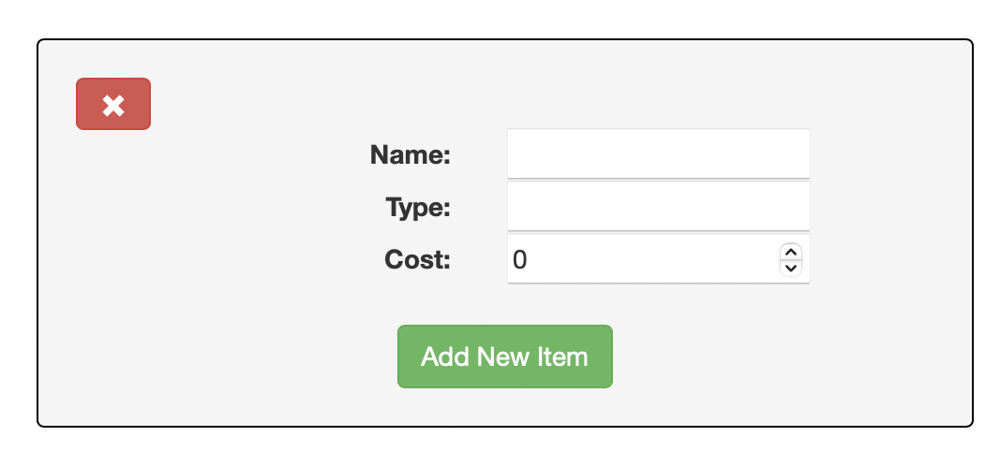
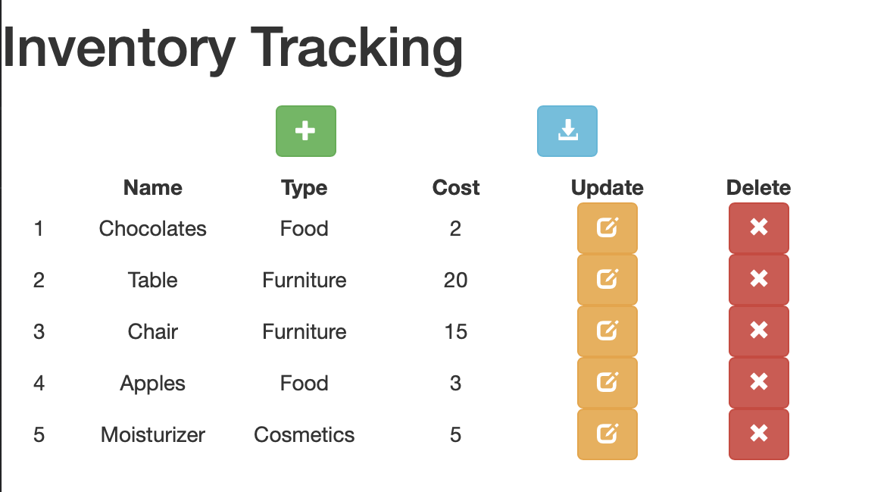
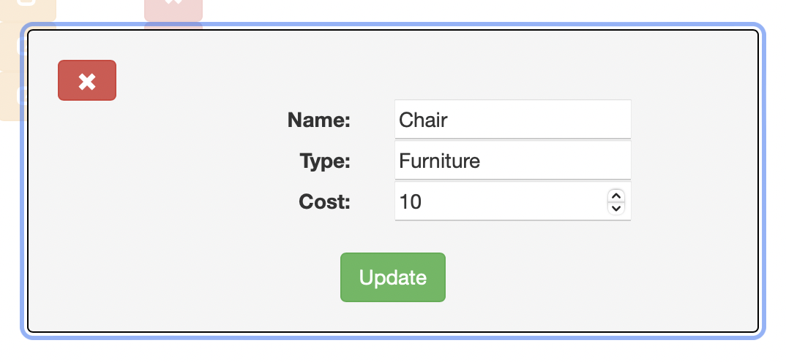
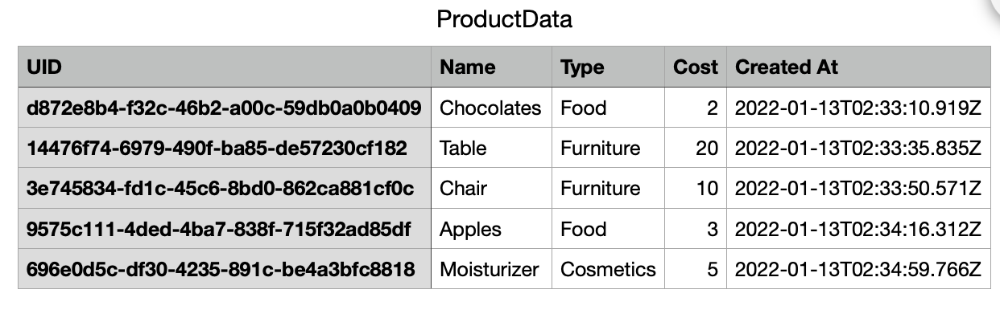

# Shopify Backend Developer Intern Challenge - Summer 22 

## Inventory Tracking

### Task

Build and Inventory Tracking Web Application with the following requirements - 

Basic CRUD functionality :
- Create Inventory Items
- Read and show all items
- Update Inventory Items
- Delete Items

Additional functionality :
- Push button to export Product Data to a CSV file

## Description 

The webpage is a Single Page Application consisting of basic CRUD functionality. There is a MongoDB backend that connects to the Node.js server over Mongoose. 

An inventory item is defined as collection with the following properties - 

- Unique ID
- Name
- Type
- Cost
- Created At (Timestamp)

The frontend is a React.js framework that displays the list of items currently in the inventory. Items in the inventory can be created, updated and deleted. There is also an additional functionality to download the inventory items as CSV files.


Adding an Item - 



List of all Items - 



Updating an Item -



CSV of Product Data -



## Directory Structure
```
├── bin 
│   └── www
├── client
│   ├── bundle.js
│   ├── bundle.js.LICENSE.txt
│   ├── bundle.js.map
│   ├── components
│   │   ├── Add.js
│   │   ├── App.js
│   │   ├── Delete.js
│   │   ├── ExportCSV.js
│   │   └── Update.js
│   ├── css
│   │   └── App.css
│   ├── helpers
│   │   ├── addData.js
│   │   ├── deleteData.js
│   │   ├── getData.js
│   │   └── updateData.js
│   ├── index.ejs
│   ├── index.js
│   └── routes
│       └── routes.js
├── package-lock.json
├── package.json
├── server
│   ├── config
│   │   └── local.json
│   ├── controllers
│   │   └── inventory.controller.js
│   ├── models
│   │   └── Inventory.js
│   ├── routes
│   │   └── routes.js
│   ├── server.js
│   ├── services
│   │   └── inventory.service.js
│   └── utils
│       └── index.js
└── webpack.config.js
```

## How To Run

### Step 1 - 

Clone the repository 

`git clone https://github.com/aish-where-ya/Shopify-challenge.git`

Move to the `inventory-tracking` folder by running

`cd Shopify-challenge/inventory-tracking` 

### Step 2 - 

Make sure that you have the latest version of Node.js and MongoDB installed. 

For Node.js refer - https://nodejs.org/en/download/

For MongoDB refer - https://docs.mongodb.com/manual/installation/

Note -  This project requires the latest versions of both these packages. (In normal cirsumstances I would have containerized this and run it using a Dockerfile)

### Step 3 -

Run the MongoDB server using your OS's service manager 

Ubuntu - `sudo systemctl start mondod`

OSX - `brew services start mongodb-community@5.0` (this version is recommended)

For other OS, please refer the docs.

Additional server configurations can be modified in `inventory-tracking/server/config/local.json`

### Step 4 - 

In the `inventory-tracking` folder, install the packages and start the project.

`npm i`

`npm start`


## Coded With 

- Node.js
- React.js
- Express.js
- MongoDB
- Mongoose